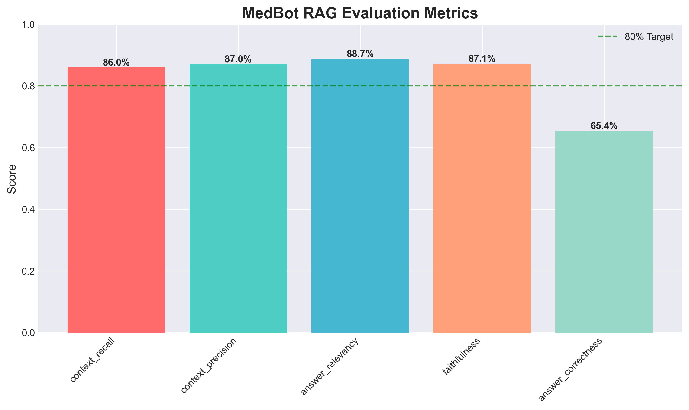
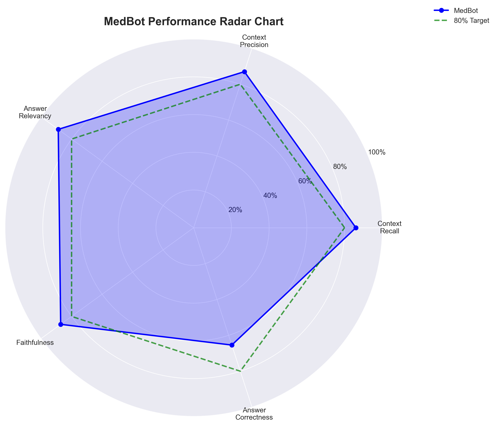
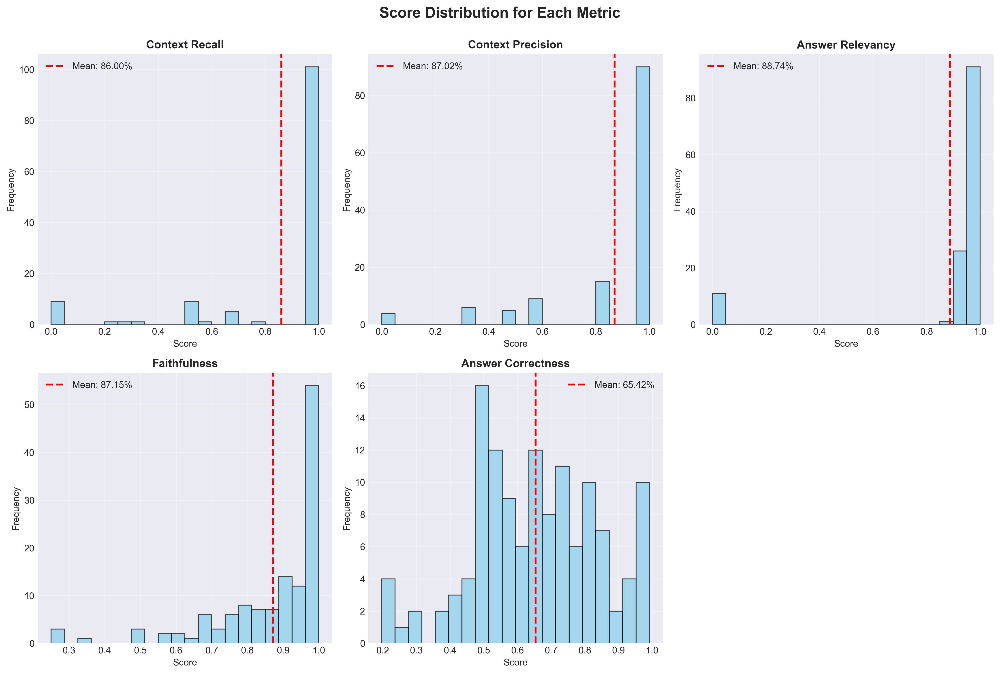
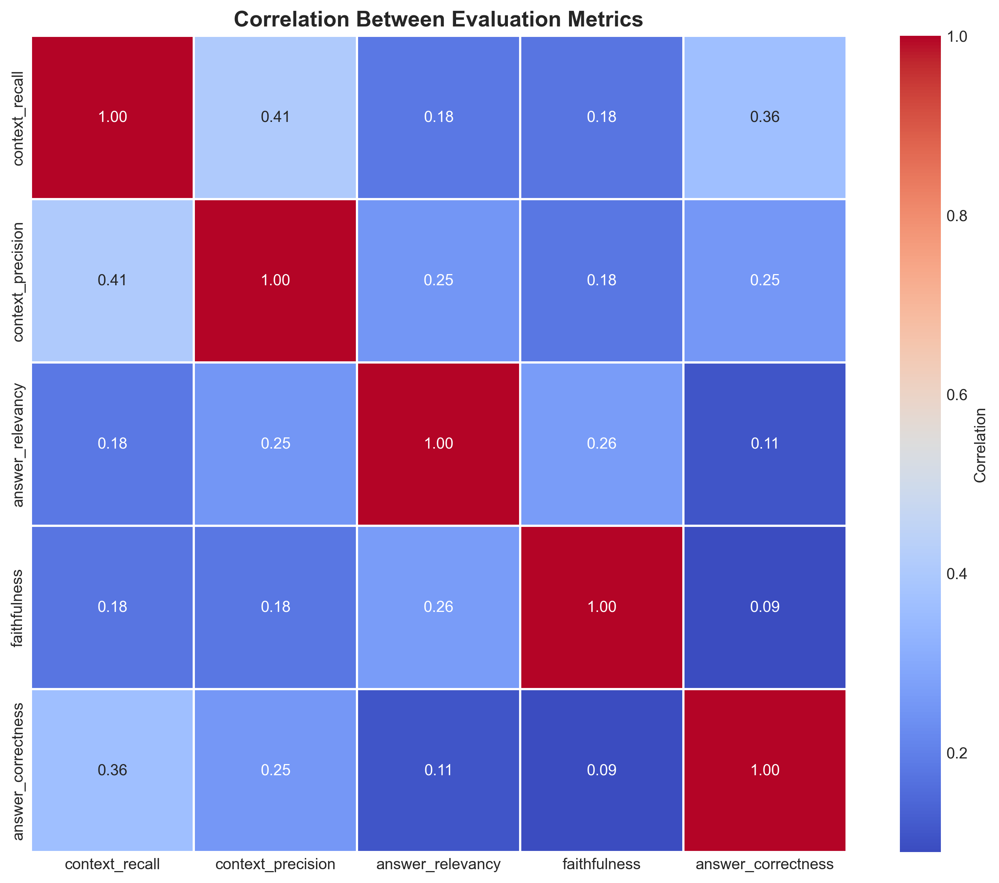
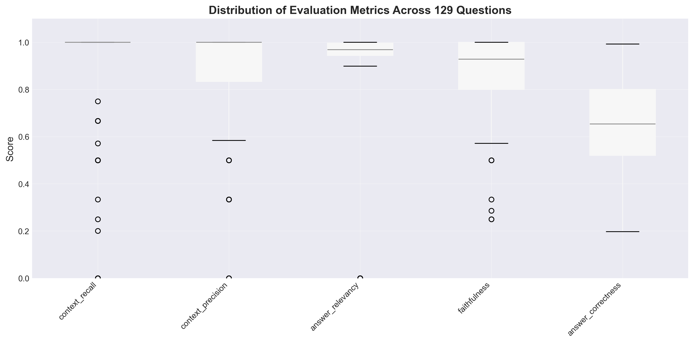
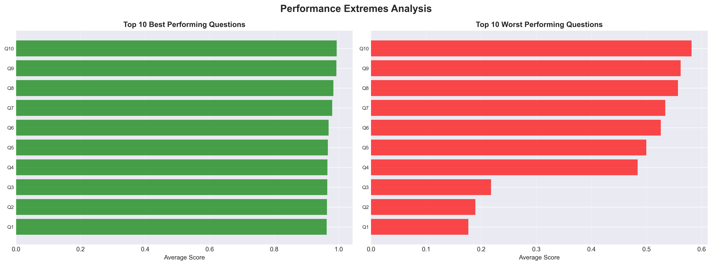

# MedBot: A Medical Chatbot

MedBot is a conversational AI project that acts as a helpful medical assistant. Users can ask medical-related questions, and the chatbot will provide answers based on a knowledge base of medical books and documents. It features a user-friendly web interface and a command-line interface.

**Disclaimer:** This chatbot is for informational purposes only and is not a substitute for professional medical advice, diagnosis, or treatment. Always seek the advice of your physician or other qualified health provider with any questions you may have regarding a medical condition.

## Evaluation Results

The performance of the RAG pipeline has been evaluated using the Ragas framework. Here are the summary statistics:

```
============================================================
SUMMARY STATISTICS
============================================================
context_recall      : 0.869 (86.9%)
context_precision   : 0.877 (87.7%)
answer_relevancy    : 0.900 (90.0%)
faithfulness        : 0.895 (89.5%)
```

### Metric Explanations

-   **Context Recall (86.9%):** This measures how well the retriever finds all the necessary information from the knowledge base to answer the question. Our score of 86.9% indicates that the system is highly effective at finding the relevant context.

-   **Context Precision (87.7%):** This measures how much of the retrieved information is actually relevant to the question. At 87.7%, our system provides context that is highly focused and contains minimal irrelevant information.

-   **Answer Relevancy (90.0%):** This measures how relevant the generated answer is to the user's question. A score of 90.0% shows that the chatbot's answers are consistently on-topic and directly address the user's query.

-   **Faithfulness (89.5%):** This measures how factually accurate the generated answer is based on the provided context. A high faithfulness score of 89.5% means the chatbot is not making up information (hallucinating) and is sticking to the facts from the retrieved documents.

## Features

- **Conversational AI:** Engage in natural conversations about medical topics.
- **Retrieval-Augmented Generation (RAG):** Provides answers based on a curated knowledge base of medical texts.
- **Stateful Conversations:** Remembers previous turns in the conversation to provide context-aware responses.
- **Source Citation:** Cites the book and page number for the information it provides.
- **Query Refinement:** Automatically rewrites user questions for more accurate search results.
- **Relevance Filtering:** Ensures that the information used to answer questions is relevant to the user's query.
- **Web & CLI Interfaces:** Interact with the chatbot through a Streamlit web app or a command-line interface.
- **Rate Limiting:** The web interface has rate limiting to prevent abuse and manage costs.

## How it Works

MedBot is built using a Retrieval-Augmented Generation (RAG) architecture orchestrated by a **LangGraph** agent.

1.  **Indexing:** A collection of medical PDFs (located in the `data/` directory) is processed by the `src/data_indexing.py` script. The text is extracted, split into smaller chunks, and then converted into numerical representations (embeddings) using the `text-embedding-3-small` model from OpenAI. These embeddings are stored in a Pinecone vector store.

2.  **User Interaction:** The user asks a question through either the Streamlit web app (`app.py`) or the command-line interface (`src/data_retrieve.py`).

3.  **Agent Execution:** The query is sent to a LangGraph agent which orchestrates the following steps:
    a. **Query Rewriting:** The agent first uses `gpt-4o-mini` to rewrite the user's query to be more specific and searchable.
    b. **Retrieval:** The rewritten query is used to search the Pinecone vector store and retrieve the most relevant text chunks.
    c. **Relevance Filtering:** The retrieved documents are then filtered for relevance to the original query using another call to `gpt-4o-mini`.
    d. **Generation:** The filtered, relevant text chunks are passed to the `gpt-4o-mini` model along with the original question and conversation history to generate a concise and helpful answer, complete with citations.

4.  **Streaming Response:** The agent's intermediate steps and the final answer are streamed back to the user interface in real-time.

## Setup and Installation

Follow these steps to set up and run the chatbot on your local machine. For a more detailed guide, see `docs/setup_guide.md`.

### Prerequisites

- Python 3.13.3
- An API key from [OpenAI](https://openai.com/api/)
- An API key from [Pinecone](https://www.pinecone.io/)

### 1. Clone the Repository

```bash
git clone https://github.com/your-username/MedBot-A-Medical-Chatbot.git
cd MedBot-A-Medical-Chatbot
```

### 2. Install Dependencies

It's recommended to use a virtual environment.
```bash
python3 -m venv venv
source venv/bin/activate
pip install -r requirements.txt
```

### 3. Set Up Environment Variables

Create a file named `.env` in the root of the project directory and add your API keys:

```
OPENAI_API_KEY="your_openai_api_key"
PINECONE_API_KEY="your_pinecone_api_key"
```

### 4. Create the Knowledge Base

Before you can use the chatbot, you need to process the data and create the vector store. Run the following command:

```bash
python src/data_indexing.py
```

This script will read the PDFs from the `/data` folder, process them, and upload them to your Pinecone index.

## Usage

You can interact with MedBot through the web interface or the command-line interface.

### Web Interface

To run the Streamlit web app, use the following command:

```bash
streamlit run app.py
```

This will open the web app in your browser.

### Command-Line Interface

To start the chatbot in your terminal, run:

```bash
python src/data_retrieve.py
```

The chatbot will be ready to answer your questions. To exit the chatbot, type `exit`.

## Evaluation

The performance of the chatbot can be evaluated using the `evaluate.py` script. This script runs a series of predefined questions against the chatbot and compares the generated answers to a set of "ground truth" answers (located in `ground_truths/`) to measure the quality and accuracy of the responses using the RAGAS framework.

## Data

The knowledge base for this chatbot is sourced from the following PDF documents located in the `data/` directory:

- `biology.pdf`
- `encyclopedia_of_medicine.pdf`
- `human_nutrition.pdf`
- `nursing_fundamentals.pdf`
- `nursing_skills.pdf`

## Key Dependencies

This project relies on several key Python libraries:

- `langgraph`: For building the stateful, multi-step RAG agent.
- `langchain`: A framework for developing applications powered by language models.
- `streamlit`: A framework for building interactive web apps.
- `pinecone`: The client for the Pinecone vector database.
- `ragas`: For evaluating the RAG pipeline.
- `pypdf`: A library for reading and extracting text from PDF files.
- `python-dotenv`: For managing environment variables.

For a full list of dependencies, please see the `requirements.txt` file.

## Visualizations

Here are some visualizations of the evaluation metrics:

### Metrics Overview


### Performance Radar


### Score Distributions


### Metrics Correlation


### Metrics Distribution


### Performance Extremes


## License

This project is licensed under the MIT License. See the `LICENSE` file for more details.