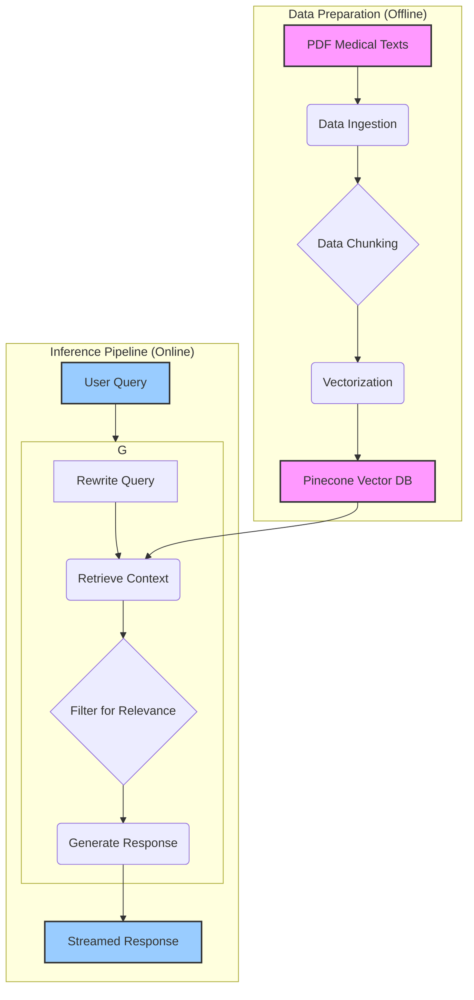

# MedBot Technical Architecture

## Table of Contents
1. [System Architecture](#1-system-architecture)
2. [Component Breakdown](#2-component-breakdown)
3. [Data Flow](#3-data-flow)
4. [Technology Stack](#4-technology-stack)
5. [Vector Database](#5-vector-database)
6. [The LangGraph Agent](#6-the-langgraph-agent)
7. [Session Management](#7-session-management)

---

## 1. System Architecture

The MedBot system is designed around a sophisticated **LangGraph** agent that orchestrates a Retrieval-Augmented Generation (RAG) pipeline. It leverages state-of-the-art NLP models and a vector database to provide accurate, context-aware answers to medical questions.

## 2. Component Breakdown

The architecture is composed of several key modules:

| Component | Description |
|---|---|
| **Data Ingestion** | Loads raw medical documents (PDFs) from the `data/` directory using `PyPDFLoader`. |
| **Data Chunking** | Splits documents into smaller, 800-character chunks with a 40-character overlap using `RecursiveCharacterTextSplitter`. This maintains context while preparing data for retrieval. |
| **Vectorization (Embedding)** | Converts text chunks into 700-dimensional vectors using OpenAI's `text-embedding-3-small` model. These embeddings capture the semantic meaning of the text. |
| **Vector Storage & Indexing**| Stores the vectorized chunks in a Pinecone vector database, organized in an index named `medbot`. |
| **The LangGraph Agent** | The core of the online pipeline. This stateful agent manages the entire process from query to response, orchestrating query rewriting, retrieval, relevance filtering, and generation. |
| **Web Interface (Streamlit)** | A user-friendly web application (`app.py`) that handles user interaction, displays the conversation, and manages rate limiting. |
| **Command-Line Interface (CLI)** | A terminal-based interface (`src/data_retrieve.py`) for direct interaction with the chatbot. |

## 3. Data Flow

The data flow is bifurcated into an offline indexing phase and an online inference phase.

1.  **Offline Indexing**:
    *   Medical PDF documents are placed in the `/data` directory.
    *   The `src/data_indexing.py` script is run.
    *   `load_and_filter_documents` (from `src/data_ingestion.py`) loads the PDFs.
    *   `split_text_into_chunks` (from `src/data_chunking.py`) splits them into chunks.
    *   The script then uses `OpenAIEmbeddings` to create vectors for each chunk.
    *   These vectors and their metadata are uploaded to the Pinecone `medbot` index.

2.  **Online Inference (Agent Execution)**:
    *   A user enters a query via the Streamlit UI or the CLI.
    *   The query is sent to the **LangGraph agent**.
    *   **Node 1: Rewrite Query**: The agent first uses `gpt-4o-mini` to rewrite the user's query into a more precise and searchable format.
    *   **Node 2: Retrieve Context**: The rewritten query is used to search the Pinecone vector store, retrieving the top 3 most relevant document chunks.
    *   **Node 3: Filter for Relevance**: The retrieved chunks are passed to `gpt-4o-mini` to validate their relevance to the *original* query. Only relevant chunks proceed.
    *   **Node 4: Generate Response**: The filtered, relevant chunks are combined with the original query in an augmented prompt. This is sent to `gpt-4o-mini` to generate a final, citable answer.
    *   The agent's intermediate steps and the final answer are streamed back to the user interface in real-time.

## 4. Technology Stack

| Technology | Role | Justification |
|---|---|---|
| **Python 3.13.3** | Core Programming Language | Mature ecosystem, extensive libraries for data science and AI. |
| **LangGraph** | Agent Framework | Provides the backbone for our stateful, multi-step RAG agent, allowing for complex logic like query rewriting and filtering. |
| **LangChain** | RAG Components | Used for data loading, splitting, and integrating with models and vector stores. |
| **Pinecone** | Vector Database | A managed, high-performance vector database for low-latency similarity search. |
| **OpenAI GPT-4o-mini** | Generation & Reasoning | Powers query rewriting, relevance filtering, and final answer generation. |
| **OpenAI text-embedding-3-small** | Embedding Model | Efficient and powerful model for generating semantic embeddings. |
| **Streamlit** | Web Interface | A pure-Python framework for rapidly building interactive web apps. |
| **RAGAS** | Evaluation Framework | Provides key metrics for assessing the performance of the RAG pipeline. |

## 5. Vector Database

*   **Provider**: Pinecone
*   **Index Name**: `medbot`
*   **Vector Dimensions**: 700
*   **Metric**: Cosine Similarity

Each record in Pinecone contains the vector embedding and metadata, including the source document and the original text chunk, enabling traceability and citations.

## 6. The LangGraph Agent

The agent is the most critical part of the system. It's a stateful graph where each node represents a step in the RAG process.

*   **State**: The agent maintains a state object that includes the original query, rewritten query, retrieved documents, and relevance checks.
*   **Nodes**: The graph consists of nodes for rewriting the query, retrieving documents, filtering for relevance, and generating the final answer.
*   **Edges**: Conditional edges connect the nodes, allowing the graph to dynamically decide the next step. For example, if no relevant documents are found after filtering, the agent can proceed directly to a "cannot answer" response.

This graph-based approach provides a clear, modular, and extensible way to manage the complex workflow of the RAG pipeline.

## 7. Session Management

In the Streamlit web application (`app.py`), user sessions are managed using `st.session_state`.

*   **Chat History**: `st.session_state.messages` stores the entire conversation history for the current session, allowing the UI to re-render it on each interaction.
*   **Thread ID**: `st.session_state.thread_id` assigns a unique UUID to each user session. This ID is passed to the LangGraph agent to maintain conversation history and context across multiple turns.
*   **Agent Caching**: `st.session_state.agent` stores the initialized LangGraph agent. This prevents the agent from being recreated on every user interaction, which significantly improves performance.
