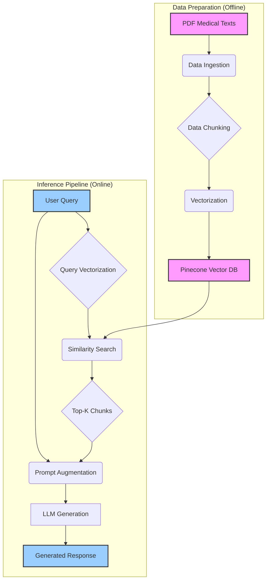

# MedBot Technical Architecture

## Table of Contents
1. [System Architecture](#1-system-architecture)
2. [Component Breakdown](#2-component-breakdown)
3. [Data Flow](#3-data-flow)
4. [Technology Stack](#4-technology-stack)
5. [Vector Database](#5-vector-database)
6. [RAG Pipeline](#6-rag-pipeline)

---

## 1. System Architecture

The MedBot system is designed as a modular Retrieval-Augmented Generation (RAG) pipeline. It leverages state-of-the-art NLP models and a vector database to provide accurate, context-aware answers to medical questions based on a private knowledge base.



## 2. Component Breakdown

The architecture is composed of several key modules:

| Component | Description |
|---|---|
| **Data Ingestion** | Loads raw medical documents (PDFs) from the specified data directory. This is the entry point for all knowledge into the system. |
| **Data Chunking** | Splits the loaded documents into smaller, semantically coherent text chunks. This is critical for effective retrieval, as it ensures the retrieved context is focused and relevant. We use a chunk size of 1000 characters with a 200-character overlap to maintain context between chunks. |
| **Vectorization (Embedding)** | Converts each text chunk into a high-dimensional numerical vector using an embedding model (`text-embedding-3-small`). These vectors capture the semantic meaning of the text. |
| **Vector Storage & Indexing**| Stores the vectorized chunks in a specialized vector database (Pinecone). An efficient index is built to enable rapid similarity searches. |
| **Retrieval** | When a user submits a query, it is first vectorized. The system then searches the Pinecone index for the 'Top-K' document chunks whose vectors are most similar to the query vector (k=3). |
| **Augmented Generation** | The retrieved chunks are combined with the original user query to form an augmented prompt. This prompt is fed to a powerful Large Language Model (LLM), which generates a final, human-readable response grounded in the provided context. |

## 3. Data Flow

The data flow is bifurcated into an offline indexing phase and an online inference phase.

1.  **Offline Indexing**:
    *   Medical PDF documents are placed in the `/data` directory.
    *   The `data_ingestion.py` script loads these documents.
    *   `data_chunking.py` splits them into 1000-character chunks with a 200-character overlap.
    *   `data_indexing.py` uses the OpenAI `text-embedding-3-small` model to create a 700-dimension vector for each chunk.
    *   These vectors, along with their corresponding text and metadata, are uploaded and indexed in the Pinecone `medbot` index.

2.  **Online Inference**:
    *   A user enters a query into the Streamlit web interface.
    *   The query is sent to the backend agent.
    *   The query is vectorized using the same embedding model.
    *   The vector is used to perform a similarity search in Pinecone, retrieving the top 3 most relevant document chunks.
    *   The `agent.py` module constructs a detailed prompt containing the user's question and the retrieved context.
    *   This augmented prompt is sent to the OpenAI GPT-4o-mini API.
    *   The model generates a response, which is streamed back to the user through the UI. The temperature is set to 0 to ensure deterministic and factual answers.

## 4. Technology Stack

| Technology | Role | Justification |
|---|---|---|
| **Python 3.13** | Core Programming Language | Mature ecosystem, extensive libraries for data science and AI (e.g., Pandas, NumPy), and strong community support. |
| **LangChain** | RAG Framework | Provides robust orchestration for building complex LLM chains. Simplifies the integration of data sources, models, and retrieval mechanisms. |
| **Pinecone** | Vector Database | A managed, high-performance vector database that scales effortlessly. It offers low-latency similarity search, which is crucial for a real-time chatbot experience. |
| **OpenAI GPT-4o-mini** | Generation Model | Offers a strong balance of performance, cost, and reasoning capability. Its instruction-following and generation quality are ideal for this application. |
| **OpenAI text-embedding-3-small** | Embedding Model | A highly efficient and powerful model for generating semantic embeddings. Its 700-dimension output provides a good trade-off between detail and computational cost. |
| **RAGAS** | Evaluation Framework | A specialized framework for evaluating RAG pipelines. It provides key metrics like Faithfulness, Context Recall, and Answer Relevancy that go beyond simple accuracy. |
| **Streamlit** | Web Interface | A pure-Python framework that makes it incredibly fast to build and deploy interactive web apps for machine learning projects. |

## 5. Vector Database

The vector database is at the heart of the retrieval system.

*   **Provider**: Pinecone
*   **Index Name**: `medbot`
*   **Vector Dimensions**: 700 (from `text-embedding-3-small`)
*   **Metric**: Cosine Similarity

### Indexing Strategy

Each record in the Pinecone index corresponds to a single text chunk and contains:

1.  **Vector ID**: A unique identifier for the chunk (e.g., a UUID).
2.  **Vector Values**: The 700-dimensional embedding of the text chunk.
3.  **Metadata**:
    *   `text`: The original text of the chunk.
    *   `source_document`: The filename of the PDF from which the chunk was extracted.
    *   `chunk_id`: The sequential index of the chunk within its source document.

This metadata is crucial for traceability and allows the system to cite sources if needed. The index is optimized for fast and accurate similarity search, forming the foundation of the RAG pipeline's retrieval step.

## 6. RAG Pipeline

The RAG (Retrieval-Augmented Generation) pipeline is what allows MedBot to answer questions based on a private knowledge base, reducing hallucinations and providing verifiable information.

**Step 1: Retrieval**
The process begins with a user query, which is converted into an embedding. This embedding is used to query the Pinecone vector store. The store returns the `Top-K` (k=3) chunks of text that are semantically closest to the query. This is the **"Retrieval"** part of RAG.

**Step 2: Augmentation**
The retrieved text chunks (context) are then fused with the original query into a carefully engineered prompt. The prompt template looks something like this:

```
"Use the following context to answer the question at the end. If you don't know the answer, just say that you don't know.

Context:
---
{retrieved_chunk_1}
---
{retrieved_chunk_2}
---
{retrieved_chunk_3}
---

Question: {user_query}"
```

This is the **"Augmented"** part of RAG.

**Step 3: Generation**
The final, augmented prompt is sent to the GPT-4o-mini model. The LLM's task is not to answer from its own internal knowledge, but to synthesize an answer based *only* on the context provided. This grounding in source material is what ensures the answers are factual and relevant. This is the **"Generation"** part of RAG.
